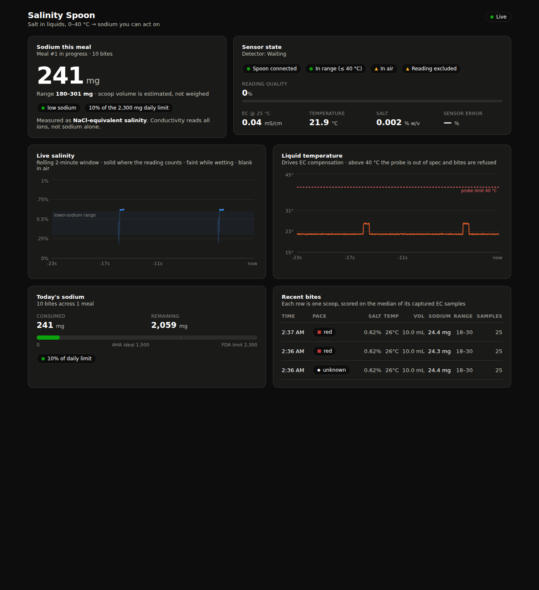
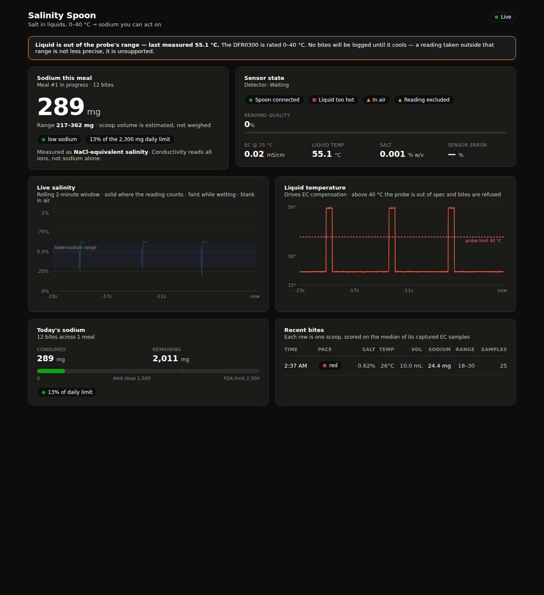

# Salinity Spoon

A spoon that measures the salt in what you eat and tells you what it means for
your sodium intake.

An ESP32 reads a conductivity probe, a temperature probe and an accelerometer,
fuses them into per-bite sodium estimates, and streams them to a live dashboard
that tracks intake against daily limits.



---

## Quick start — no hardware needed

The mock spoon runs the same state machine the firmware does and speaks the real
protocol over the real WebSocket, so dashboard work never blocks on hardware.

```bash
# 1. Backend
python3 -m venv .venv
.venv/bin/pip install -r backend/requirements.txt
cd backend && ../.venv/bin/python -m uvicorn app.main:app --host 0.0.0.0 --port 8000

# 2. Mock spoon (new terminal)
.venv/bin/python tools/mock_spoon.py --salt 0.62 --temp 26 --pace 9

# 3. Dashboard (new terminal)
cd dashboard && npm install && npm run dev
```

Open http://localhost:5173.

`--host 0.0.0.0` on the backend matters: the ESP32 connects from another machine,
so binding to localhost makes the spoon invisible.

Useful flags:

| Flag | Effect |
|---|---|
| `--salt 0.9` | a saltier liquid |
| `--temp 55` | **above the probe's 40 °C limit — watch every bite get refused** |
| `--pace 8` | eat fast, to drive the pace cue red |
| `--noise 0.5` | crank EC noise until the quality gate rejects bites |

---

## Operating envelope

**Salt in liquids between 0 and 40 °C.** Cooled or room-temperature broths,
stocks, cold soups, brines, beverages and cooking liquids.

This is the probe's rating, and it is enforced rather than hoped for. Above
40 °C the firmware refuses to log a bite, the LED signals wait, and the backend
rejects the event even if a device sends it anyway. A reading taken outside the
rated range is not a less-precise reading — it is an unsupported one, because the
temperature compensation was never characterised out there.



Read [`docs/measurement-protocol.md`](docs/measurement-protocol.md) before
trusting a number.

---

## How it works

```
ESP32 ──WiFi/WebSocket──► FastAPI ──WebSocket──► React dashboard
  │                          │
  │ EC + temp + IMU          └── SQLite: meals & bites
  └── fused into per-bite events
```

Everything is built around **one contract** —
[`docs/telemetry-schema.md`](docs/telemetry-schema.md). Firmware, mock, backend
and dashboard all speak it, in two event types: high-rate `sample/v1` that stays
local, and `bite/v1`, the durable record.

### The accelerometer decides which readings count

A probe in air reads near zero; a probe in a liquid being stirred reads
turbulence. Every sample carries a `quality` score fused from submersion,
settledness and signal stability. Low-quality samples are charted faintly and
excluded from every reported number, and a bite's salinity is the **median** of
its captured samples — so one bubble cannot move a sodium figure.

### Sampling fast is what makes bites measurable

A real scoop is ~0.5 s in the liquid. Sampling EC at 100 Hz through the ADS1115
yields ~50 samples in that window — more evidence than a slow 2-second settle
ever had, in a tenth of the time. See
[`docs/bite-detection.md`](docs/bite-detection.md).

### Conductivity can spot a potassium salt substitute

The probe cannot tell sodium from potassium — it reads all ions. Normally a
limitation. But salt substitutes *are* potassium chloride, so a product
**labelled** low-sodium that **measures** high ionic content is probably
substituting.

That matters clinically: for people with kidney disease, or on ACE inhibitors,
ARBs or potassium-sparing diuretics, excess potassium risks hyperkalemia. No food
database or barcode app can detect it. A conductivity measurement can.

Declare a label claim on the dashboard and every bite is checked against FDA
per-serving limits. It flags; it never diagnoses.

### Liquids only, and honest about it

The probe reads liquids, so solids are entered by hand and shown as
**self-reported**, never merged into the measured figure. In a representative
day that is 1,040 mg self-reported against 870 mg measured — over half the total
would be invisible if the gap were papered over.

### Replay mode

The backend records every ingested event, and `tools/replay.py` plays a session
back through the identical pipeline with timestamps shifted to now. If the
hardware dies before judging, the demo still runs. It is also how thresholds get
tuned without standing over a bowl.

```bash
curl -X POST localhost:8000/api/recording/start -H 'Content-Type: application/json' -d '{"label":"broth"}'
# ... take some bites ...
curl -X POST localhost:8000/api/recording/stop
python tools/replay.py backend/recordings/<file>.jsonl --loop
```

### Volume is calibrated, not weighed

There is no load cell. Scoop volume is calibrated per user, and the honest
consequence is stated everywhere a number appears: **per bite ≈ ±27%, per meal
≈ ±10%**, because random scoop variation cancels as √n across a meal. The meal
total — what a clinician actually reads — is roughly three times more accurate
than any single bite.

---

## Layout

| Path | What it is |
|---|---|
| `firmware/spoon/` | ESP32 sketch — sensors, bite detection, pace LED, WebSocket |
| `backend/app/` | FastAPI — ingest, broadcast, meal segmentation, SQLite |
| `dashboard/` | React + Vite + TypeScript |
| `tools/mock_spoon.py` | Simulator running the same state machine |
| `tools/replay.py` | Replays a recorded session through the live pipeline |
| `docs/` | Contract, measurement protocol, bite detection, wiring, calibration |

**Picking this up cold?** Start with [`HANDOFF.md`](HANDOFF.md) — current state,
hard constraints, decisions already made, and what to do next.

Also: [`docs/engineering-notes.md`](docs/engineering-notes.md) — what was hard and
how it was solved. [`docs/demo-script.md`](docs/demo-script.md) — the
ninety-second walkthrough.

## Hardware

ESP32-WROOM-32 · DFRobot Gravity Analog EC V2 (DFR0300, K=1) · **ADS1115** ·
DS18B20 · MPU-6050 (GY-521) · RGB LED

**Read [`docs/wiring.md`](docs/wiring.md) before wiring anything.** The EC probe
goes through the ADS1115, never into an ESP32 ADC pin.

### Arduino libraries

OneWire · DallasTemperature · Adafruit MPU6050 · Adafruit ADS1X15 · ArduinoJson ·
WebSockets (Markus Sattler) ·
[DFRobot_ESP_EC](https://github.com/GreenPonik/DFRobot_ESP_EC_BY_GREENPONIK)
(install as ZIP — not in the Library Manager)

Board: **ESP32 Dev Module**. No COM port? Install the Silicon Labs CP210x VCP
driver — the HiLetgo board uses a CP2102.

---

## Accuracy, honestly

- **It measures NaCl-equivalent salinity, not sodium.** Conductivity reads all
  ions — potassium, magnesium, dissolved organics. Say the former, never the
  latter.
- **±5% of full scale**, so ±1 mS/cm absolute. Relative error grows as readings
  shrink, which is why we measure high in the 1–15 mS/cm recommended band and do
  not dilute by default.
- **The probe is a consumable.** Rated >0.5 year, distilled water only, never
  soaked. The platinum-black coating is destroyed by tap water, permanently.
- **Not food-safe.** A measurement instrument, not a utensil.
- Sodium per bite assumes a calibrated scoop volume. `POST
  /api/devices/{id}/volume` sets it; see `docs/calibration.md` §3.

## Status

Skeleton complete and verified end to end against the simulator: a simulated
0.62% liquid reads back as 0.62%, meal totals aggregate correctly, and the
temperature interlock refuses bites at 55 °C and −5 °C on both the device and
the server while accepting the 40 °C boundary.

Label checking, manual entry and record/replay are built and verified against
the simulator.

Next: first light on real hardware. Bench each sensor individually per the
checks in `docs/wiring.md`, then run all three calibrations.
